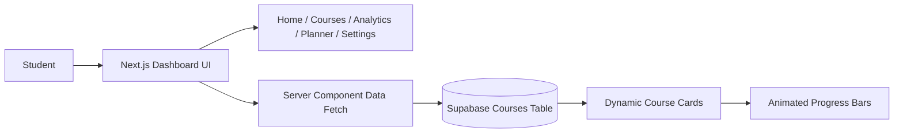
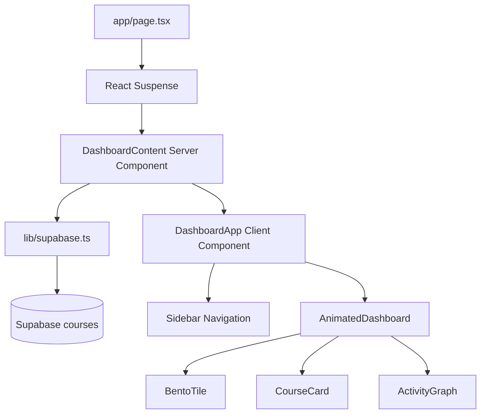

# Next-Gen Learning Dashboard

A futuristic student learning dashboard built with **Next.js App Router**, **Supabase**, **Tailwind CSS**, **Framer Motion**, and **Lucide React**. The project focuses on a premium dark-mode Bento Grid interface, smooth motion, responsive navigation, and server-side course data fetching.

## Live Project

- **Live Demo:** https://next-gen-learning-liard.vercel.app/
- **GitHub Repository:** https://github.com/Sandeep9026/Next-Gen-Learning

## Preview

The dashboard is designed as a modern student command center with a dark interface, animated Bento cards, live course progress, analytics, planner tasks, and responsive navigation.



## Key Features

| Area | Details |
| --- | --- |
| Dashboard Layout | Dark-mode Bento Grid with hero tile, course tiles, activity chart, metrics, and focus queue |
| Navigation | Responsive sidebar on desktop and bottom navigation on mobile |
| Live Data | Course data fetched from Supabase using server-side data fetching |
| Animations | Framer Motion staggered card entrance, spring hover states, progress animation, and nav highlight |
| Course Cards | Dynamic Lucide icon rendering, course title, animated progress bar, and gradient mesh background |
| Analytics | Average progress, deep-work stats, contribution-style activity graph, and skill-balance bars |
| Planner | Focus sessions, execution tasks, and next practice block |
| Error Handling | Graceful Supabase connection error card instead of a broken UI |
| Loading UX | Skeleton loading state with subtle pulse animation |
| Responsiveness | Desktop, tablet, and mobile layouts handled with Tailwind CSS |

## Tech Stack

- **Framework:** Next.js App Router
- **Language:** TypeScript
- **Database/BaaS:** Supabase PostgreSQL
- **Styling:** Tailwind CSS
- **Animations:** Framer Motion
- **Icons:** Lucide React
- **Deployment:** Vercel

## Architecture



The project keeps the server/client boundary clear:

- `DashboardContent` runs on the server and fetches course records from Supabase.
- `DashboardApp` stores the active dashboard section on the client.
- `AnimatedDashboard` handles Framer Motion transitions and interactive Bento sections.
- `CourseCard` renders Supabase course data with dynamic icons and animated progress bars.

## Supabase Database

The project expects a `courses` table with this schema:

| Column | Type | Description |
| --- | --- | --- |
| `id` | uuid | Primary key |
| `title` | text | Course name |
| `progress` | integer | Course completion percentage |
| `icon_name` | text | Lucide icon name used by the UI |
| `created_at` | timestamp | Course creation timestamp |

Run the SQL from `supabase-schema.sql` in the Supabase SQL editor to create and seed the table.

## Environment Variables

Create a `.env.local` file in the project root:

```env
NEXT_PUBLIC_SUPABASE_URL=your-supabase-project-url
NEXT_PUBLIC_SUPABASE_ANON_KEY=your-supabase-anon-key
```

The repository includes `.env.example` for reference. Real environment values should be added locally and in Vercel, not committed to GitHub.

## Run Locally

```bash
npm install
npm run dev
```

Open:

```text
http://localhost:3000
```

## Build Check

```bash
npm run build
```

The production build verifies TypeScript, Next.js routing, and page generation.

## Deployment

The project is deployed on Vercel:

```text
https://next-gen-learning-liard.vercel.app/
```

For deployment:

1. Import the GitHub repository into Vercel.
2. Keep the framework preset as Next.js.
3. Add the Supabase environment variables in Vercel project settings.
4. Deploy the project.

## Folder Structure

```text
app/
  error.tsx
  globals.css
  layout.tsx
  loading.tsx
  page.tsx
components/
  activity-graph.tsx
  animated-dashboard.tsx
  bento-tile.tsx
  course-card.tsx
  dashboard-app.tsx
  dashboard-content.tsx
  dashboard-skeleton.tsx
  sidebar.tsx
lib/
  supabase.ts
  types.ts
  utils.ts
supabase-schema.sql
```

## Assignment Checklist

- Next.js App Router implemented
- Supabase course data fetched on the server
- Tailwind CSS dark-mode Bento UI
- Framer Motion animations and micro-interactions
- Lucide icons with dynamic course icon rendering
- Skeleton loading state
- Graceful error handling
- Responsive desktop, tablet, and mobile layouts
- `.env.example` included
- README documentation included
- GitHub repository published
- Vercel deployment completed
